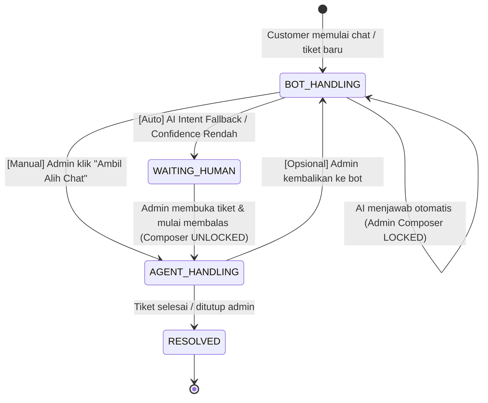

# Tech Planning: AI Chatbot to Human Handoff & Edge Cases Architecture
**Project:** MobilJuragan (CV. Mobil Juragan Express Transport, Merauke)  
**Tujuan:** Arsitektur transisi percakapan cerdas dari AI Chatbot ke Staf/Admin manusia di Flutter Mobile App dan Next.js Admin Dashboard (`Customer Care`).  
**Status Dokumen:** Planning & Edge Case Hardening (Belum masuk implementasi runtime).

---

## 1. Latar Belakang & Inti Masalah

Pada aplikasi chat konvensional (seperti WhatsApp), indikator pesan belum dibalas ditandai oleh badge angka (misal badge hijau `1`) yang murni dipicu oleh `unread_count > 0` dari pengirim.

Jika sistem chat mengintegrasikan **AI Chatbot**:
- Ketika customer bertanya dan AI langsung menjawab otomatis, status pesan terakhir di database adalah *outbound* (dari bot).
- Akibatnya, pada dashboard admin biasa, chat terlihat "sudah dibalas/selesai" padahal customer mungkin tidak puas atau membutuhkan penanganan staf manusia (seperti negosiasi sewa khusus, armada darurat, atau konfirmasi sewa khusus Merauke).
- Jika admin tidak memiliki penanda visual khusus dan sistem penguncian (*chat lock*), admin tidak dapat membedakan mana percakapan yang aman ditangani bot dan mana yang mendesak membutuhkan intervensi staf manusia.

---

## 2. Arsitektur State-Based Handoff & Lock Lifecycle

Solusi yang disepakati adalah **State-Based Handoff & Admin Composer Locking**:



### Definisi State:
1. **`BOT_HANDLING` (Default / Bot Aktif)**
   - AI bot aktif melayani percakapan pelanggan.
   - **Admin Composer State:** **TERKUNCI (*Disabled / Read-Only*)**.
     - Admin di dashboard dapat membaca transkrip percakapan secara *real-time*.
     - Text input composer dinonaktifkan dengan placeholder: *"Chat sedang ditangani AI. Klik 'Ambil Alih Chat' untuk membalas manual."*
     - Tombol aksi utama: **`[Ambil Alih Chat]`** (warna Navy/Teal).
2. **`WAITING_HUMAN` (Eskalasi / Menunggu Admin)**
   - Terpicu secara otomatis ketika AI mendeteksi kebutuhan admin manusia atau customer meminta bantuan manusia.
   - **Tindakan Sistem:**
     - AI Bot otomatis **di-mute / dimatikan** (`isAiActive = false`).
     - Kartu tiket di daftar tiket kiri (`Screen / Customer Care`) memunculkan **Badge Merah** di pojok kanan atas.
     - Tiket berpindah ke antrean teratas tab *"Perlu Tindakan / Menunggu Respon"*.
     - Sound/Browser notification berbunyi untuk staf operasional.
     - Chat composer admin otomatis **TERBUKA (*Unlocked*)**.
3. **`AGENT_HANDLING` (Sedang Ditangani Staf)**
   - Staf admin telah mengambil alih atau mengirim pesan balasan pertama.
   - Status tiket berubah menjadi `IN_PROGRESS` dengan `assignedAdminId = currentUserId`.
   - Bot tetap nonaktif sampai tiket diselesaikan atau admin secara eksplisit mengembalikan ke bot.

---

## 3. UI/UX Dashboard Admin (`Screen / Customer Care`)

Mengacu pada screenshot Figma `docs/figma-raw/dashboard/09-customer-care.png`:

### 3.1. Kartu Tiket Masuk (Daftar Kiri)
- **Badge Merah di Pojok Kanan Atas:**
  - Letak: Sudut kanan atas card tiket (sesuai penandaan user).
  - Tipe: Dot merah berdenyut (pulsing dot) atau Badge angka merah yang menghitung jumlah pesan customer sejak eskalasi terjadi (`unread_after_escalation`).
- **Status Chip Indikator:**
  - `[Ditangani AI]` $\rightarrow$ Warna abu-abu netral / Soft Teal.
  - `[Butuh Admin]` $\rightarrow$ Warna Merah / Oranye tegas.
  - `[Aktif - Anda]` $\rightarrow$ Warna Navy / Hijau.
- **SLA Timer:** Teks kecil indikator durasi tunggu: *"Menunggu 3 mnt"*.

### 3.2. Area Chat Panel (Kanan)
- **Banner Pemisah Sistem (*System Event Divider*):**
  > `─── 🤖 AI mengalihkan percakapan ke Admin Manusia (Alasan: Permintaan Customer) • 06.25 WIT ───`
- **Interaksi Composer:**
  - Kondisi Bot Aktif: Input disabled + Tombol **`[Ambil Alih Chat]`**.
  - Kondisi Handoff Aktif: Input aktif + Tombol **`[Kirim Balasan]`**.

---

## 4. Analisis Edge Cases & Mitigasi Teknis

| No | Skenario Edge Case | Potensi Masalah | Solusi & Mitigasi Teknis |
|---|---|---|---|
| 1 | **Race Condition: Admin & AI Membalas Bersamaan** | Admin klik "Ambil Alih" tepat saat AI sedang streaming response ke customer. Pesan bot dan pesan admin bisa tumpang tindih. | Saat aksi "Ambil Alih" atau event handoff terjadi, backend mengirim sinyal abort (`AbortController.abort()`) ke pipeline LLM. Pesan parsial bot dibatalkan dan tidak di-commit ke database `ticket_messages`. |
| 2 | **Customer Spamming Saat Menunggu Admin** | Customer mengirim 3-5 pesan berurutan karena admin belum membalas. Bot tidak sengaja hidup lagi. | Guard condition backend: Jika `status == WAITING_HUMAN`, webhook message masuk **TIDAK AKAN** memicu LLM handler. Hanya append pesan ke database dan menaikkan counter badge merah di dashboard admin. |
| 3 | **Request Handoff di Luar Jam Operasional (Malam Hari WIT)** | Customer minta bicara manusia jam 23.00 WIT, tidak ada admin yang standby di kantor CV. Mobil Juragan. | Bot memberikan pesan penjelas otomatis: *"Staf kami beroperasi pukul 08.00 - 17.00 WIT. Permintaan Anda sudah kami catat dalam tiket #TK-xxxx dan akan diprioritaskan saat jam operasional buka."* Status tetap `WAITING_HUMAN` agar muncul di pagi hari. |
| 4 | **Admin Mengembalikan Chat ke AI (*Handback to Bot*)** | Setelah admin menjawab kendala khusus (misal: konfirmasi sewa), customer hanya bertanya jam buka kantor (FAQ umum). | Sediakan tombol di menu aksi tiket: **`[Kembalikan ke AI Bot]`**. Saat diklik, `isAiActive` kembali `true`, composer admin terkunci kembali, dan banner sistem ditampilkan: *"Chat dikembalikan ke AI Bot"*. |
| 5 | **Customer Menutup Aplikasi Mobile Saat Menunggu** | Admin membalas setelah 5 menit, namun customer sudah keluar dari layar chat/aplikasi. | Integrasi Push Notification (FCM). Jika `isCustomerOnline == false` saat admin membalas, backend mentrigger push notification ke perangkat Flutter customer: *"Admin MobilJuragan membalas tiket Anda: [kutipan pesan]"*. |
| 6 | **Intent Flapping (False Positives)** | Customer hanya bercanda atau mengetik "makasih mas admin bot", AI salah mengira itu permintaan manusia. | Gunakan 2-layer Intent Validation: (1) Reranker score + Confidence score, (2) Jika ambigu, AI mengirimkan tombol konfirmasi: *"Apakah Anda ingin saya hubungkan dengan staf kami? [Ya, Hubungkan] [Tidak, Lanjut Chat]"*. |

---

## 5. Dua Opsi Engine AI (Rekomendasi Hardware Laptop Hylmi)

Berdasarkan audit spesifikasi hardware laptop dev (**Intel Core i7-13650HX 14-Core, RAM 32 GB, NVIDIA GeForce RTX 4060 Laptop 8GB VRAM**):

### Opsi A: Local Model di Laptop Dev (Gratis, Mandiri, Privacy Penuh)
Laptop dev memiliki performa sangat tinggi dan **sangat mumpuni** untuk menjalankan LLM lokal 100% pada GPU.

- **Rekomendasi Framework:** **Ollama** (via Windows atau WSL2 Ubuntu).
- **Rekomendasi Model Utama:**
  1. **`qwen2.5:7b-instruct-q4_K_M` (~4.7 GB VRAM)**:
     - **Kenapa cocok:** Sangat fasih Bahasa Indonesia, menguasai structured JSON output, kecepatan di RTX 4060 mencapai **35–50 tokens/detik**.
     - VRAM 4.7 GB muat sepenuhnya di dalam 8 GB VRAM RTX 4060 tanpa tumpah ke RAM sistem (*zero offloading penalty*).
  2. **`llama3.2:3b-instruct-fp16` atau `qwen2.5:3b` (~2.5 GB VRAM)**:
     - Alternatif ultra-ringan dengan kecepatan > 80 tokens/detik, sangat cocok jika laptop sedang dipakai merender Flutter + Next.js build secara bersamaan.
- **Rekomendasi Reranker / Embeddings (RAG FAQ Rental):**
  - Embedding: `BAAI/bge-m3` (support multilingual & bahasa Indonesia).
  - Reranker: `BAAI/bge-reranker-v2-m3` (skor 0.0 – 1.0; jika skor tertinggi dokumen rental < 0.60 $\rightarrow$ otomatis Fallback ke Admin Manusia).

### Opsi B: Cloud API / Kenari AI / SemutSSH API (Ringan untuk Staging Tim)
Sesuai konfigurasi yang sudah dicatat pada context dump tim (`https://ai.semutssh.com/v1/messages` atau OpenAI-compatible `/v1/chat/completions`):
- **Kelebihan:** Laptop staging tidak terbebani komputasi AI saat anggota tim lain menguji aplikasi secara bersamaan lewat jaringan Tailscale (`100.104.118.105:4000`).
- **Implementasi:** Endpoint Express API cukup memanggil adapter `POST /v1/chat/completions` dengan fallback function calling.

---

## 6. Penyesuaian Data Model (`schema.prisma`) untuk Mendukung Handoff

```prisma
enum TicketStatus {
  OPEN
  WAITING_HUMAN    // Menunggu respon staf manusia (badge merah aktif)
  IN_PROGRESS      // Sedang ditangani oleh admin tertentu
  WAITING_CUSTOMER // Menunggu respon customer
  RESOLVED
  CLOSED
}

enum MessageSenderType {
  CUSTOMER
  AI_BOT           // Pesan dari chatbot otomatis
  ADMIN            // Pesan dari staf manusia
  SYSTEM           // Notifikasi event (handoff, penutupan tiket, dll)
}

model SupportTicket {
  id                  String         @id @default(uuid())
  ticketNumber        String         @unique
  customerId          String
  customer            User           @relation(fields: [customerId], references: [id])
  assignedAdminId     String?        // ID staf admin yang mengambil alih
  isAiActive          Boolean        @default(true) // false saat handoff terjadi
  unreadHumanCount    Int            @default(0)    // penanda badge merah di dashboard
  status              TicketStatus   @default(OPEN)
  messages            TicketMessage[]
  createdAt           DateTime       @default(now())
  updatedAt           DateTime       @updatedAt

  @@index([status])
  @@index([customerId])
}

model TicketMessage {
  id         String            @id @default(uuid())
  ticketId   String
  ticket     SupportTicket     @relation(fields: [ticketId], references: [id])
  senderId   String?           // nullable jika dari AI_BOT atau SYSTEM
  senderType MessageSenderType @default(CUSTOMER)
  body       String
  sentAt     DateTime          @default(now())

  @@index([ticketId])
}
```

---

## 7. Kesimpulan & Langkah Tim Selanjutnya

1. Dokumen ini menjadi acuan spesifikasi teknis dan pertajaman arsitektur sebelum coding milestone M14 (*Help dan Customer Care*).
2. Perubahan penambahan fitur AI chatbot ini akan dikomunikasikan ke kelompok sesuai aturan tata kelola di `docs/PLANNING_TECH_STACK_DAN_ROADMAP.md` (roadmap §1 line 42).
